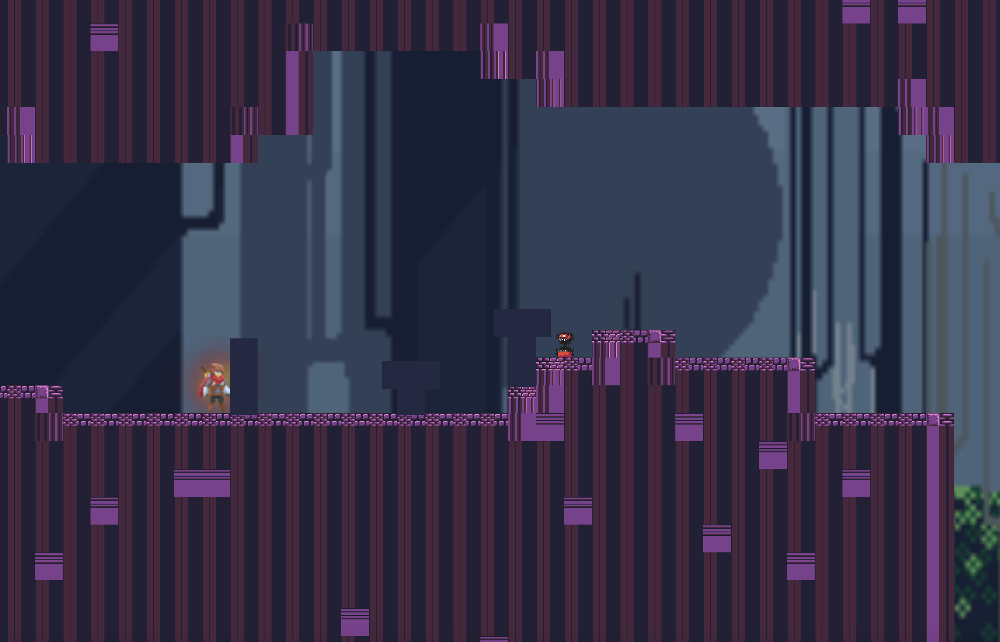

# LuxMake 
Originally a fork from [Tux Builder](https://github.com/Alzter/TuxBuilder)

An attempt to make a more elaborate 2D builder game, WIP.

## To Play the game
1. Install Godot
[You can get Godot Here](https://godotengine.org/)

2. Download The repo 
Once you have those unzip the source code and open src/project.godot, and press play.

## Features 
Name | Desciption | Status
--- | --- | ---
`Stackable Blocks` | **Weighted blocks that can be moved in game** | **Done**
`On/Off switch` | **Button that can be tied to operate certain elements ** | **-**
`Trail` | **Trail that placed elements will follow ** | **-**
`Glue` | **To Connect elements permanently** | **-**
`Throwing Knife` | **Throwing Knife that sticks to walls for navigation** | **Done**

## Controls

`wasd` Walking
`/` Interact
`space` Jump / Double Jump
`right shift` throw knifes
`.` explode knifes
`Jump + down` Down attack

